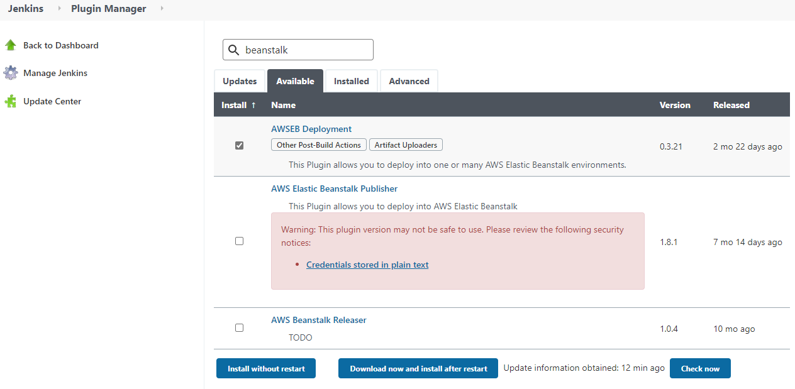
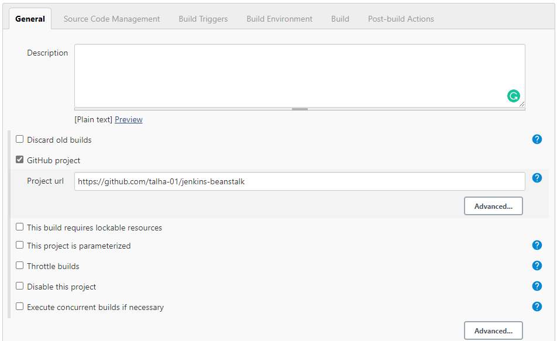
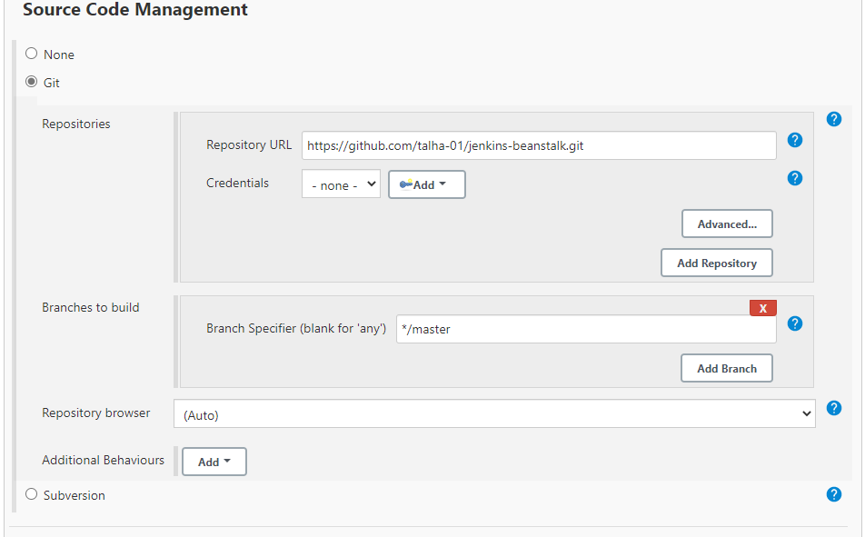
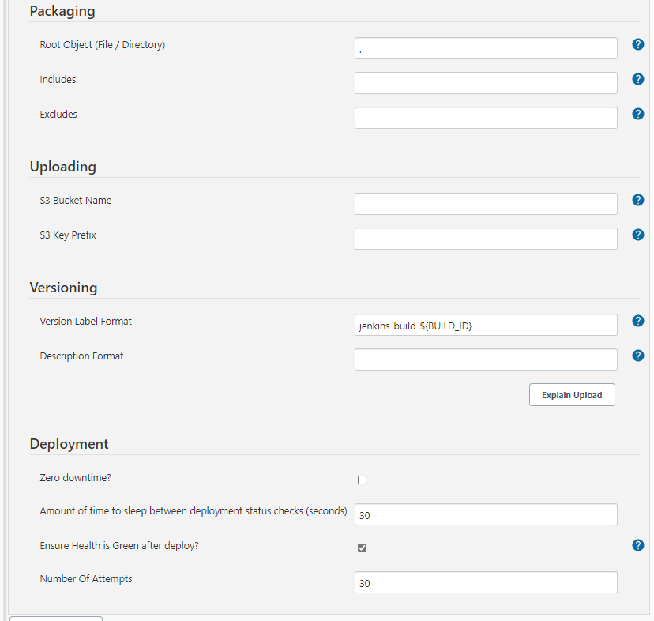

# Automate the deployment of a sample flask application through GitHub, Jenkins and AWS Elastic Beanstalk

## Create a Jenkins instance, an environment and a sample application using the attached CloudFormation template.
You can follow the the creation of your resources via the CloudFormation Events tab or using the services themselves, EC2 and Elastic Beanstalk.

## Open the Jenkins GUI on your favorite browser using the output of the CloudFormation template


## SSH into the Jenkins instance and get the password
SSH into the Jenkins instance by using your key pair and the instance's IP address.
```bash
ssh -i <key.pem> ubuntu@<ip_address>
```


Run the following command to get the Administrator Password to unlock Jenkins
```bash
sudo cat /var/lib/jenkins/secrets/initialAdminPassword
```


## Paste the password into Jenkins screen to unlock Jenkins
Copy the password we got from the Jenkins instance and paste it into the password bar and then click Continue.


## Customize Jenkins
By using the menu on the screen, `install suggested plugins` and create the first admin user.


Save and continue until you see the following screen.


## Install Elastic Beanstak plugin
Go to `Manage Jenkins` on the main menu and select `Manage Plugins`. Select the `Available` tab and enter beanstalk into the search bar. Select `AWSEB Deployment` and `Install without restart`.



## Create a `Freestyle project` and give it a name
Click on `Create a job` link on the screen, give your project a name, select `Freestyle project`.

## Configure the Jenkins project
For this tutorial, you need to create a GitHub repository or use an existing one.


Copy your GitHub project URL and paste it into `GitHub project Project url` bar in the `General` section on the Jenkins screen.  



Select `Git` in the `Source Code Management` section, and paste the GitHub repository URL (The repository url is same as the project url except it ends with .git)



Select `GitHub hook trigger for GITScm polling` in the `Build Triggers` section in order for GitHub to trigger Elastic Beanstalk after each push event. This process requires configuring our GitHub repository webhook settings.


Integrating our GitHub account with Jenkins requires configuration of our GitHub repository webhooks settings.
We add the webhook after specifying the `Payload URL` as `http://<JenkinsIPAddress>:8080/github-webhook/` and `Content type` as application/json.


We need to add `AWS Elastic Beanstalk` as a build step in the `Build` section.


In the AWS Elastic Beanstalk menu, we do NOT need to configure `Credentials` since the CloudFormation template we used gives necessary permissions to our Jenkins instance. However, we need to specify our region. 
We also need to enter `Application Name` and `Environment Name` properly and validate it with the `Validate Coordinates` button to make sure.
After adding a single dot `.` in the `Root Object` bar, we need to specify a `Version Lable Format`. We can specify it as `jenkins-build-${BUILD_ID}`. We can also set the `Amount of time to sleep between deployment status checks` as 30 seconds, to speed up this process.




## Now, It is the time to test our automation!
First, we need to push an application into our GitHub repository. We can use the sample application in this GitHub repo for this purpose.
```bash
git init
git add .
git commit -m 'some comment'
git remote add origin https://github.com/<GitHubAccount>/<RepositoryName>.git
git push -u origin master
```
After the commands above, our GitHub repository will have been populated with the necessary files and will trigger Jenkins to start the process. If it is not triggered by itself, we can trigger the first build manually. The following commits will be built and deployed automatically.


## With this setup, any new commit to our GiTHub repository will be reflected automatically!
Any new commit will be automatically deployed through our Elastic Beanstalk environment. We can follow the process via Jenkins Console Output and Elastic Beanstalk environment. Finally, we will see the changed page on the browser using the Elastic Beanstalk link!


